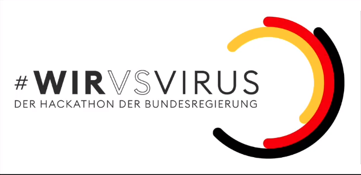

Datapool of COVID-19 cases
++++++++++++++++++++++++++

Introduction
============

This datapool (database) tries to collect data from different sources
and provides them (refurbished) as a simple to use REST interface.

This project was founded during the *WirVsVirus* Hackathon of the
German government which took place from 2020-03-20 until 2020-03-22.

